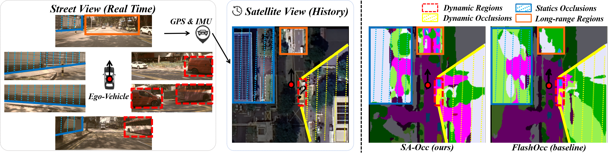
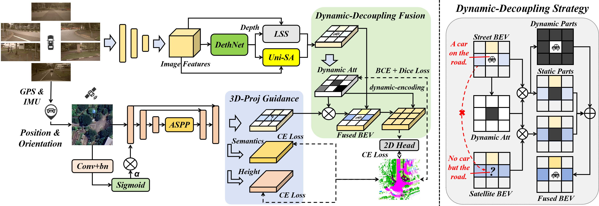

<div align="center">
<h1>SA-Occ</h1>
<h2>SA-Occ: Satellite-Assisted 3D Occupancy Prediction in Real World</h2>
</div>

<div style="text-align: center;">
  
</div>

Our SA-Occ exhibits enhanced robustness compared to the baseline, especially in nighttime conditions.

<div style="text-align: center;">
  
</div>

<details>
  <summary>
  <font size="+1">Introduce</font>
  </summary>
   Street views provide real-time observations but are significantly affected by occlusions from both static (blue regions occluded by the wall and door) and dynamic objects (yellow regions occluded by the vehicles). Additionally, perspective projections lead to sparse observations in distant regions. Integrating satellite imagery enhances perception, particularly in occluded areas and distant regions (orange boxes). However, a key challenge in fusing satellite and street views is the inconsistency of dynamic objects due to the temporal gap between observations (red boxes: absence of the dynamic vehicle in satellite view).
</details>

<p align="center">
   <br>
</p>

<details>
  <summary>
  <font size="+1">Abstract</font>
  </summary>
Existing vision-based 3D occupancy prediction methods are inherently limited in accuracy due to their exclusive reliance on street-view imagery, neglecting the potential benefits of incorporating satellite views. We propose SA-Occ, the first Satellite-Assisted 3D occupancy prediction model, which leverages GPS & IMU to integrate historical yet readily available satellite imagery into real-time applications, effectively mitigating limitations of ego-vehicle perceptions, involving occlusions and degraded performance in distant regions. To address the core challenges of cross-view perception, we propose: 1) Dynamic-Decoupling Fusion, which resolves inconsistencies in dynamic regions caused by the temporal asynchrony between satellite and street views; 2) 3D-Proj Guidance, a module that enhances 3D feature extraction from inherently 2D satellite imagery; and 3) Uniform Sampling Alignment, which aligns the sampling density between street and satellite views. Evaluated on Occ3D-nuScenes, SA-Occ achieves state-of-the-art performance, especially among single-frame methods, with a 39.05% mIoU (a 6.97% improvement), while incurring only 6.93 ms of additional latency per frame. 
</details>

## Latest News
- 2025/03/17: Code of **SA-Occ** is released. 🚀

## Main Results

|                                               Config                                                | Frame | Backbone | Backbone(Sat) | Input <br/>Size |  mIoU   |                                Model                                |                                              Log                                               |
|:---------------------------------------------------------------------------------------------------|:--------:|:--------:|:------------:|:----------:|:-------:|:-------------------------------------------------------------------:|:----------------------------------------------------------------------------------------------:|
|                 [**BEVDetOCC**](projects/configs/bevdet_occ/bevdet-occ-r50.py)                 |   1    |   R50    |      -       |  256x704   |  31.60  |                                            [gdrive]()                                            |                                            [log]()                                            |
|                 [**M1: FlashOCC**](projects/configs/flashocc/flashocc-r50.py)                  |   1    |   R50    |      -       |  256x704   |  32.08  | [gdrive](https://drive.google.com/file/d/1k9BzXB2nRyvXhqf7GQx3XNSej6Oq6I-B/view?usp=drive_link)  | [log](https://drive.google.com/file/d/1NRm27wVZMSUylmZxsMedFSLr7729YEAV/view?usp=drive_link)  |
|                 [**V1: SA-OCC**](projects/configs/sa_occ/sa-occ-r50.py)                  |   1    |   R50    |     R18      |  256x704   |  39.05  | [gdrive](https://drive.google.com/file/d/1Dh2B_Z1OYYBrepsUvw1c1wbbLv_3iCcH/view?usp=drive_link)  | [log](https://drive.google.com/file/d/1HvuNC2enYpzGC5pgeJf21WYh8jjMHQxv/view?usp=drive_link)  |
|       [**BEVDetOCC-4D-Stereo**](projects/configs/bevdet_occ/bevdet-occ-r50-4d-stereo.py)       |   2    |   R50    |      -       |  256x704   |  36.1   |                [baidu](https://pan.baidu.com/s/1237QyV18zvRJ1pU3YzRItw?pwd=npe1)                 |                [log](https://pan.baidu.com/s/1237QyV18zvRJ1pU3YzRItw?pwd=npe1)                |
|        [**M2:FlashOCC-4D-Stereo**](projects/configs/flashocc/flashocc-r50-4d-stereo.py)        |   2    |   R50    |      -       |  256x704   |  37.84  | [gdrive](https://drive.google.com/file/d/12WYaCdoZA8-A6_oh6vdLgOmqyEc3PNCe/view?usp=drive_link)  | [log](https://drive.google.com/file/d/1eYvu9gUSQ7qk7w7lWPLrZMB0O2uKQUk3/view?usp=drive_link)  |
|                 [**V2: SA-OCC**](projects/configs/sa_occ/sa-occ-r50-stereo4d.py)                  |   2    |   R50    |     R18      |  256x704   |  40.65  | [gdrive](https://drive.google.com/file/d/1R1ww5ctSZDQ64ZkMD4BDW2Adwlhiy6Oy/view?usp=drive_link)  | [log](https://drive.google.com/file/d/13XlM0KtSADpq3UsCEkMg4gHIA6jvpW4x/view?usp=drive_link)  |
|                 [**V3: SA-OCC**](projects/configs/sa_occ/sa-occ-r50-stereo4d.py)                  |   8    |   R50    |     R18      |  256x704   |  41.69  | [gdrive](https://drive.google.com/file/d/1_IaIHxAQhHuDsogfbe3VgUtTsHoM-Xyr/view?usp=drive_link)  | [log](https://drive.google.com/file/d/1tlNiRhdwfvllUt-Xi0mwdNRU5cU81QSr/view?usp=drive_link)  |              |
|    [**M3:FlashOCC-4D-Stereo**](projects/configs/flashocc/flashocc-stbase-4d-stereo-512x1408_4x4_2e-4.py)     |   2    |  Swin-B  |      -       | 512x1408   |   43.52 | [gdrive](https://drive.google.com/file/d/1f6E6Bm6enIJETSEbfXs57M0iOUU997kU/view?usp=drive_link)  | [log](https://drive.google.com/file/d/1tch-YK4ROGDGNmDcN5FZnOAvsbHe-iSU/view?usp=drive_link)  |
|                 [**V4: SA-OCC**](projects/configs/sa_occ/sa-occ-stbase-ur18-4d-512x1408_4x4_2e-4.py)                  |   2    |  Swin-B  |     R18      |  512x1408  |  43.90  | [gdrive](https://drive.google.com/file/d/1iP7LzoMqb7nD2kg63ss6197B-9qiynFZ/view?usp=drive_link)  | [log](https://drive.google.com/file/d/1z-Ynm_LKWgyOASAWlEGehjBPgaZ2TnN4/view?usp=drive_link)  |
|                 [**V5: SA-OCC**](projects/configs/sa_occ/sa-occ-stbase-ur50-4d-512x1408_4x4_2e-4.py)                  |   2    |  Swin-B  |     R50      |  512x1408  |  44.29  | [gdrive](https://drive.google.com/file/d/1wnOGNadRJk9pBpM8Z0YJiad5jYlNdeOU/view?usp=drive_link)  | [log](https://drive.google.com/file/d/1oEEBipGh_T6NZz3mzXBjWYSz6WLSxA4b/view?usp=drive_link)  |
|                 [**V5: SA-OCC***](projects/configs/sa_occ/sa-occ-stbase-ur50-4d-512x1408_4x4_2e-4.py)                  |   2    |  Swin-B  |     R50      |  512x1408  |  44.64  | [gdrive](https://drive.google.com/file/d/1QbLxG5EOioWQqJfwIJe5hW7Yy3ABZHAu/view?usp=drive_link)  | [log](https://drive.google.com/file/d/1T4oSi9lFEG6WfiP8jFeeYSGOCFfLtGCF/view?usp=drive_link)  |

## Environment Setup

```
conda create --name SA-Occ python=3.8
conda activate SA-Occ
pip install torch==1.10.0+cu111 torchvision==0.11.0+cu111 torchaudio==0.10.0 -f https://download.pytorch.org/whl/torch_stable.html
pip install mmcv-full==1.5.3
pip install mmdet==2.25.1
pip install mmsegmentation==0.25.0

sudo apt-get install python3-dev 
sudo apt-get install libevent-dev
sudo apt-get groupinstall 'development tools'
export PATH=/usr/local/cuda/bin:$PATH
export LD_LIBRARY_PATH=/usr/local/cuda/lib64:$LD_LIBRARY_PATH
export CUDA_ROOT=/usr/local/cuda
pip install pycuda

pip install lyft_dataset_sdk
pip install networkx==2.2
pip install numba==0.53.0
pip install numpy==1.23.5
pip install nuscenes-devkit
pip install plyfile
pip install scikit-image
pip install tensorboard
pip install trimesh==2.35.39
pip install setuptools==59.5.0
pip install yapf==0.40.1

git clone git@github.com:chenchen235/SA-Occ.git

cd Path_to_SA-Occ
git clone https://github.com/open-mmlab/mmdetection3d.git

cd Path_to_SA-Occ/mmdetection3d
git checkout v1.0.0rc4
pip install -v -e . 

cd Path_to_SA-Occ/projects
pip install -v -e . 
```

## Prepare dataset

#### step 1. Prepare nuScenes dataset 

You can download nuScenes 3D detection data [HERE](https://www.nuscenes.org/download) and unzip all zip files.

Like the general way to prepare dataset, it is recommended to symlink the dataset root to `$MMDETECTION3D/data`.

The folder structure should be organized as follows before our processing.

```shell script
└── Path_to_SA-Occ/
    └── data
        └── nuscenes
            ├── maps
            ├── samples
            ├── sweeps
            ├── v1.0-trainval
```

#### step 2. For Occupancy Prediction task, download (only) the 'gts' from [CVPR2023-3D-Occupancy-Prediction](https://github.com/CVPR2023-3D-Occupancy-Prediction/CVPR2023-3D-Occupancy-Prediction) and arrange the folder as:
```shell script
└── Path_to_SA-Occ/
    └── data
        └── nuscenes
            ├── v1.0-trainval (existing)
            ├── sweeps  (existing)
            ├── samples (existing)
            ├── gts (new)
```

#### step 3. Prepare our Occ3D-NuScenes Extension Satellite Dataset

You can download our satellite data [gdrive](https://drive.google.com/file/d/138O6L0ecocVc0t2mFsIsNaM7oMK1bhM2/view?usp=drive_link) and unzip all zip files and arrange the folder as:
```shell script
└── Path_to_SA-Occ/
    └── data
        └── nuscenes
        └── sat
```

Then, the original satellite map is cropped in a directional manner using the location and orientation information from GPS & IMU, to obtain supplementary data consistent with Occ3D-Nuscenes.
```shell script
python tools/gen_sat.py
```
thus, the folder will be ranged as following:
```shell script
└── Path_to_SA-Occ/
    └── data
        └── nuscenes
            ├── v1.0-trainval (existing)
            ├── sweeps  (existing)
            ├── samples (existing)
            ├── gts (existing)
            ├── sat (new)
```

#### step 4. Download nuScenes-lidarseg from nuScenes official site and put it under data/nuscenes/. Create depth and semantic labels from point cloudby running:

```shell
python tools/generate_point_label.py
```
thus, the folder will be ranged as following:
```shell script
└── Path_to_SA-Occ/
    └── data
        └── nuscenes
            ├── v1.0-trainval (existing)
            ├── sweeps  (existing)
            ├── samples (existing)
            ├── gts (existing)
            ├── sat (existing)
            ├── lidarseg (new)
            ├── samples_point_label (new)
```

#### step 5.Create the pkl for SA-Occ by running:

```shell
python tools/create_data_bevdet.py
```
thus, the folder will be ranged as following:
```shell script
└── Path_to_SA-Occ/
    └── data
        └── nuscenes
            ├── v1.0-trainval (existing)
            ├── sweeps  (existing)
            ├── samples (existing)
            ├── gts (existing)
            ├── sat (existing)
            ├── samples_point_label (existing)
            ├── bevdetv2-nuscenes_infos_train.pkl (new)
            └── bevdetv2-nuscenes_infos_val.pkl (new)
```

## Train model
```shell
# single gpu
python tools/train.py $config
# multiple gpu
./tools/dist_train.sh $config num_gpu
```

## Test model
```shell
# single gpu
python tools/test.py $config $checkpoint --eval mAP
# multiple gpu
./tools/dist_test.sh $config $checkpoint num_gpu --eval mAP
```

## Acknowledgement

This project is made possible by the contributions of several key open-source codebases, which we acknowledge below.

- [FlashOCC](https://github.com/Yzichen/FlashOCC)
- [DualBEV](https://github.com/PeidongLi/DualBEV)
- [BEVDet](https://github.com/HuangJunJie2017/BEVDet)
- [BEVDepth](https://github.com/Megvii-BaseDetection/BEVDepth)
- [Lift-Splat-Shoot](https://github.com/nv-tlabs/lift-splat-shoot)
- [open-mmlab](https://github.com/open-mmlab)

Thanks for their excellent work!

## Bibtex

If this work is helpful for your research, please consider citing the following BibTeX entry.
